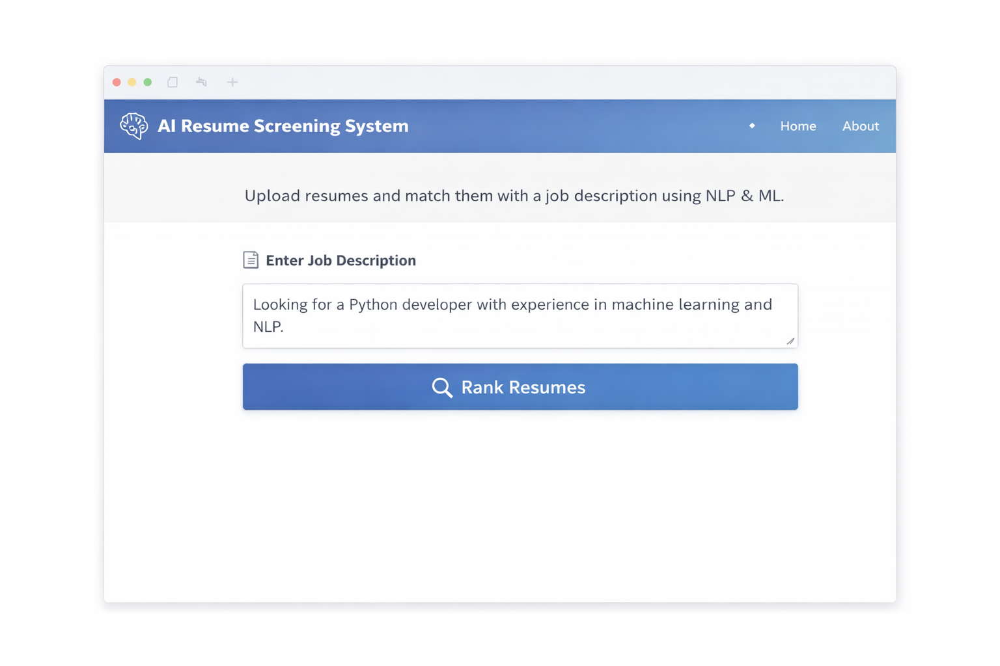
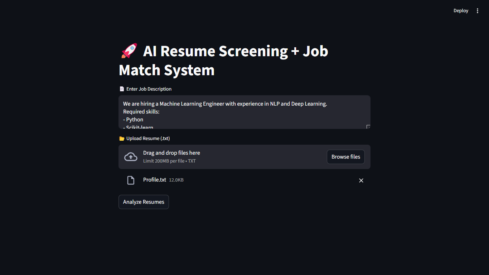
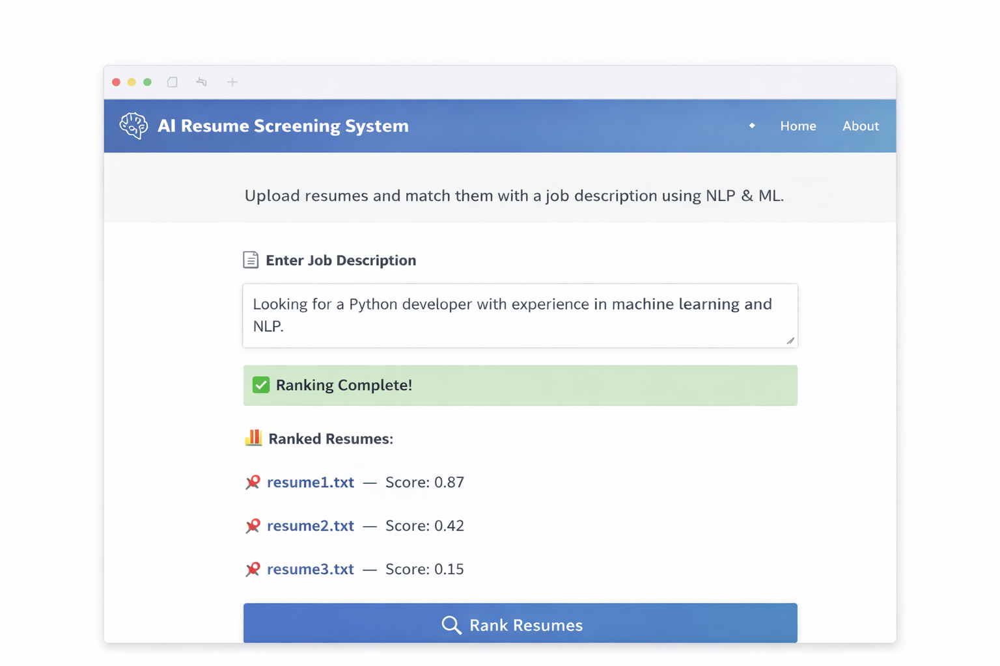

# 🚀 AI Resume Screening + Job Match System

An **AI-powered placement-oriented web application** that automates resume screening using **Natural Language Processing (NLP)** and **Machine Learning**.

This system not only ranks resumes but also:

- Extracts candidate skills  
- Predicts suitable job roles  
- Calculates resume-job match score  
- Helps automate shortlisting during placement season  

---

## 🔥 Key Features

- 📄 Job Description Input  
- 📂 Upload Multiple Resumes (.txt)  
- 🧹 Resume Text Preprocessing (NLP)  
- 🛠️ Skill Extraction Engine  
- 🎯 Job Role Prediction (Naive Bayes Model)  
- 📊 TF-IDF + Cosine Similarity Ranking  
- 🌐 Interactive Web Interface (Streamlit)  

---

## 📸 App Preview

### 🖥️ Home Screen

### 📂 Resume Upload & Skill Extraction

### 🏆 Ranking Results & Job Role Prediction

---

## 🛠️ Tech Stack

- Python  
- Natural Language Processing (NLTK)  
- Machine Learning (Scikit-learn)  
- TF-IDF Vectorization  
- Naive Bayes Classifier  
- Cosine Similarity  
- Streamlit (Web App Framework)  

---

## ⚙️ How It Works

1. The user enters a job description.
2. The user uploads one or more resume files (.txt).
3. The system:
   - Cleans and preprocesses resume text using NLP.
   - Extracts relevant technical skills.
   - Predicts the most suitable job role using a trained Naive Bayes model.
   - Converts text into TF-IDF vectors.
   - Computes cosine similarity between resumes and job description.
4. Resumes are ranked based on match percentage.
5. Results are displayed in an interactive Streamlit interface.

---

## 🎯 Placement-Oriented Use Case

This system is designed specifically for:

- Campus Placement Season
- University Placement Cells
- HR Resume Shortlisting
- Startup Hiring Automation
- AI-Based Recruitment Tools

It reduces manual screening effort and improves hiring efficiency using data-driven decision making.

---

## 🔮 Future Enhancements

- PDF Resume Parsing
- Advanced Skill Matching using NLP libraries
- Deep Learning (BERT-based resume matching)
- ATS Score Calculation
- Recruiter/Admin Dashboard
- Cloud Deployment (Render / Streamlit Cloud)
- Database Integration for resume storage
